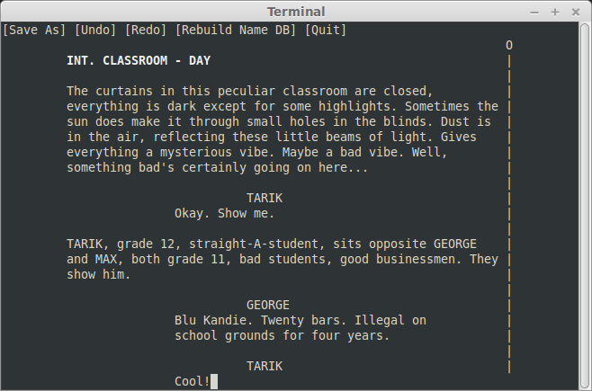

=====
Shane
=====

A poor man and/or hipster's TUI screenwriting software.

Introduction
============

Ever since the wide adoption of portable PCs screenwriters have been wondering
how they can set themselves even more apart from everyone else than just doing
their work in a local coffee shop on an expensive MacBook for everyone to see
instead of in an office on a reasonably priced computer like normal people
because nobody cares.

Now maximum apartness can be achieved: Write your screenplay in a terminal just
like in the olden days! Don't click around with your mouse. What's a mouse wheel
anyway? Feel the comfort of a fully ASCII-rendered user interface!

After all, screenplays are just text, why shouldn't screenwriting software be?

Requirements
============

:OS: Linux or MacOS
:Software: Python 3.3 or higher, ncurses

Install
=======

*Shane* does *not* need to be installed. Still, if you like to then run
``python setup.py install`` on the command line from *Shane's* root directory.

Run
===

Either run ``python run.py`` from *Shane's* root directory or (if installed)
simply run ``shane`` from wherever. To start *Shane* with opening a screenplay
add the path as a parameter, e.g.
``python run.py /home/hotshot/screenplays/romcom.fountain`` or
``shane /home/hotshot/screenplays/romcom.fountain``.

User Manual
===========

Visit `the documentation. <https://tobchen.github.io/Shane/>`_

To Do
=====

While *Shane* is a fully usable screenwriting software it's very basic and far
behind the competition (even competing freeware). Of course a lot of its
simplicity is by design but some features are still nice to have and will
probably come.

Menu
----

- Save As
    - Autocomplete path names
- Set meta data (title page stuff)

Screenplay
----------

- Meta data
- Optimize ``get_line_count()``
- Store new names automatically in name database
- Select
    - Set selection
    - Delete selection
    - Copy selection
    - Clipboard
        - Copy to internal clipboard
        - Paste from internal clipboard
        - Copy to system clipboard
        - Paste from system clipboard
- Let edit methods error check
